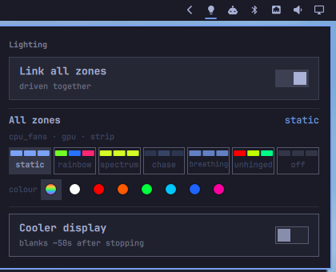
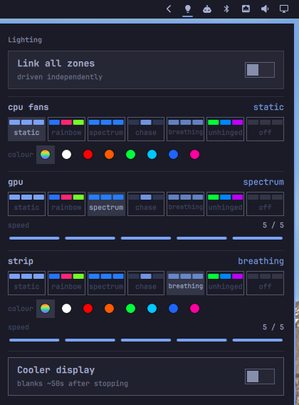

# Mimarchy

**Omarchy-native LED control for CPU cooler fans and GPU.**

A bar panel for the ARGB lighting on a CPU cooler's fans and a graphics card,
plus the cooler's built-in temperature display. It is built for
[Omarchy](https://omarchy.org/) specifically: it takes every colour from your
active Omarchy theme at startup, and it lives in the bar the way Omarchy's own
first-party panels do — click the icon, get the panel, nothing else to open.
Lighting reaches the motherboard headers and the card over the OpenRGB SDK;
the cooler's display is driven directly over HID with a protocol
reverse-engineered for it.

Runs on **Omarchy 4**.




Above: every zone linked, one shared set of controls. Below: unlinked, one
block per zone. Both are the panel itself — there is nothing behind it.

## What it does

- **Effects** — static, rainbow, spectrum, chase, breathing, and *unhinged*,
  all rendered in software from one clock so both devices stay in phase.
- **Linked or independent** — CPU and GPU move together by default; unlink to
  drive them separately.
- **Theme-driven, including the LEDs** — no colour is hardcoded. The panel
  takes its palette from your Omarchy theme, and the lighting itself can too:
  pick `theme` as a colour and the strips follow every theme switch, live.
- **Cooler display** — streams live temperature and fan speed to the panel.

## Hardware

Developed against an ASUS PRIME X870-P WIFI, a Sapphire RX 9070 XT Nitro+, and
a Balam Rush Heliux Pro HEX75 cooler. Anything OpenRGB can drive should work for
the lighting. `mimarchy-setup` finds your devices and writes the config for you
— it lists every detected zone, asks which ones to drive and how long each strip
is, and works out which OpenRGB detectors they need. `mimarchy-setup --list`
prints what it sees without changing anything, which is also the right thing to
paste into a bug report. The cooler display is specific to that USB device
(`5131:2007`).

| Tier | What |
|---|---|
| Verified | ASUS PRIME X870-P WIFI headers, Sapphire RX 9070 XT Nitro+, Balam Rush HEX75 cooler display |
| Should work | any OpenRGB device with a `Direct` or `Static` mode; several strips of different lengths; boards other than ASUS, given `detectors = [...]` in the config |
| Won't work | any cooler LCD other than `5131:2007`; devices OpenRGB itself cannot drive; firmware effects on hardware whose speed curve has not been measured (they run, at approximately the right rate) |

## Install

```bash
git clone https://github.com/villenull/mimarchy
cd mimarchy
./install.sh
```

That creates a virtualenv, narrows OpenRGB's detector list, installs the user
services — and starts them only once the detector list verifies as exactly the
safe set — and prints the two or three steps that need root or a config merge. It detects which Omarchy you are on and prints the matching desktop
integration — see below for adding the bar icon, and for a keybinding that
opens the panel directly.

If you are not on the hardware this was developed against, run the wizard first:

```bash
mimarchy-setup
tools/restrict-openrgb-detectors.py
systemctl --user restart openrgb.service mimarchy-light.service
```

The second line narrows OpenRGB to just the devices you picked; the wizard
prints it for you when it finishes.

Requires Python 3.11+, `openrgb`, and a running Wayland session. Fan RPM
additionally needs the out-of-tree `nct6687d` driver — temperatures and lighting
work without it.

### Desktop integration

**Omarchy 4.** This repo is also an Omarchy shell plugin, so the tidiest install
is to let Omarchy do the cloning and then run the installer from where it landed
— one checkout that `omarchy plugin update` keeps current:

```bash
omarchy plugin add https://github.com/villenull/mimarchy --enable
~/.config/omarchy/plugins/io.github.villenull.mimarchy/install.sh
```

That gives you the bar widget: a bulb icon that dims when the LEDs are frozen,
and a panel with effect, colour and speed for every zone, plus toggles for the
cooler display and the link. Left click opens the panel, right click toggles
the display, middle click toggles the link. There is no second window behind
it — the panel is the entire interface, effects included.

A keybinding is worth adding too, for opening the panel without touching the
mouse. Every first-party Omarchy panel answers to the same idiom — `SUPER +
CTRL + B` for Bluetooth, `SUPER + CTRL + D` for Display, and so on — so this
follows it:

```lua
o.bind("SUPER + CTRL + M", "Mimarchy", "omarchy-shell shell toggle io.github.villenull.mimarchy")
```

in `~/.config/hypr/hyprland.lua`. `SUPER + CTRL + <letter>` is claimed for
every letter except `G`, `J`, `M`, `U` and `Y` — checked against every binding
in `/usr/share/omarchy/default/hypr/bindings/*.lua` (`utilities.lua`,
`applications.lua`, `clipboard.lua`, `media.lua`, `tiling.lua`,
`voxtype.lua`). `M` is the one that reads as this plugin's name; pick another
free letter if your own config has already claimed it.

The virtualenv is created in `~/.local/share/mimarchy/` rather than inside the
checkout, which matters here: `omarchy plugin validate` refuses a symlink
anywhere in a plugin folder outside `.git`, a virtualenv contains several, and
`omarchy plugin update` re-validates and rolls back — so a venv in the checkout
would quietly make the plugin un-updatable.

Two optional extras, both printed by the installer:

| File | Merge into | Gives you |
|---|---|---|
| [`omarchy/mimarchy-menu.jsonc`](omarchy/mimarchy-menu.jsonc) | `~/.config/omarchy/extensions/omarchy-menu.jsonc` | Mimarchy in the Omarchy menu and its search |

The plugin deliberately installs no backend of its own — `omarchy plugin add`
never runs install hooks or asks for sudo, which is exactly the property that
makes it safe to run. Until `install.sh` has been run, the widget says so
instead of drawing an empty panel.

> **One ordering constraint the script handles for you:** OpenRGB's broad
> GPU/I2C detection is a documented total-system freeze on some cards
> ([#4888](https://gitlab.com/CalcProgrammer1/OpenRGB/-/issues/4888)), and its
> service starts at login. `install.sh` narrows the detector list *before*
> starting the server, and enables the server only once
> `tools/restrict-openrgb-detectors.py --check` confirms that exactly the safe
> set is enabled; if it cannot confirm that, the units are installed but
> `openrgb.service` and `mimarchy-light.service` stay disabled, and it says
> why. If you set this up by hand, do it in that order — and re-run the tool
> after ever opening the OpenRGB GUI, which rewrites the config.
>
> **The one pass it will not run for you:** OpenRGB's very first run is what
> creates its config, and that run is a detection pass with every detector
> enabled — the hazard itself. On a machine where OpenRGB has never run,
> `install.sh` stops and asks you to run `openrgb --list-devices` yourself,
> with your work saved, then re-run it. It never runs that pass on its own.
>
> **Network exposure:** the SDK protocol is unauthenticated, so
> `openrgb.service` binds the server to `127.0.0.1` only (`--server-host`);
> Mimarchy is its only client and connects to the same address. `install.sh`
> confirms the effective listener after starting it, and
> `tests/test_install_inputs.py` keeps the unit and the client in step.
>
> The allowlist follows the devices in *your* config, so it is your hardware's
> rather than this machine's. If `mimarchy-setup` shows no devices at all, that
> is the narrowing rather than your cabling — nothing can be selected that was
> never detected. `tools/restrict-openrgb-detectors.py --discover` re-enables
> everything for one detection pass, behind a typed confirmation; narrow it
> again as soon as the wizard has your zones.

## Keys

The panel takes a keyboard cursor, the same way Omarchy's other bar panels do:
open it, then move without ever touching the mouse.

| Key | Action |
|---|---|
| `h` `j` `k` `l`, arrow keys | move the cursor |
| `Enter` / `Space` | activate whatever the cursor is on |
| `1`–`6` | set the cursor's zone to static / rainbow / spectrum / chase / breathing / unhinged |
| `0` | set the cursor's zone to off |
| `+` `-` | speed up / down, every zone |
| `u` | link / unlink all zones |
| `d` | cooler display on / off |
| `Escape` | close the panel |

`1`–`6` and `0` are scoped to wherever the cursor is standing: with the cursor
on the GPU's effect row, pressing `3` sets the GPU to spectrum without
touching anything linked to it. `u`, `d`, `+` and `-` stay global regardless of
the cursor — `u` and `d` mirror the icon's own middle- and right-click, and
`+`/`-` are the coarse every-zone speed nudge (the icon's scroll wheel does
nothing; there is no zone for a scroll to pick). Keeping these four global
means the same keystroke never means two different things depending on a
cursor the user may not have summoned yet. The first press of a movement key
only reveals the cursor rather than moving it, so it never jumps in from
off-screen.

## mimarchy-ctl

The panel is not the only interface. `mimarchy-ctl` drives the same state from
a script, a Hyprland keybinding, an SSH session, or a machine with no Omarchy
desktop at all — and it is exactly what the panel itself calls, rather than
reaching into the state file directly.

```bash
mimarchy-ctl status            # or --json, which is what the widget reads
mimarchy-ctl effect rainbow
mimarchy-ctl speed +           # or -
mimarchy-ctl colour accent     # follow the theme; or green, red, ... or #ff0044
mimarchy-ctl display toggle    # on / off / toggle
mimarchy-ctl link toggle
```

Writes go through an atomic write-then-rename, so a panel click and a scripted
write cannot interleave into a half-written file. Nothing here talks to
hardware; `mimarchy-lightd` still owns that.

### Lighting that follows your theme

Give a colour a *role* — `accent`, `red`, `orange`, `yellow`, `green`, `cyan`,
`blue`, `magenta` — instead of a value, and it re-resolves whenever you change
Omarchy themes. In the panel, `theme` is the first chip in each zone's swatch
row, ahead of the seven fixed colours. The state file stores the role, so it
keeps following across reboots.

`install.sh` puts a hook in `~/.config/omarchy/hooks/theme-set.d/` that calls
`mimarchy-ctl reload-theme` after a theme switch; the daemon picks the new
colour up on its next frame, so the strips change with the wallpaper rather than
on the next reboot. Fixed hex colours are never touched by it.

Theme colours are used as authored, with one exception: a colour dimmer than
55% brightness is lifted to that floor, hue and saturation untouched. Measured
across the 22 stock themes, that lifts 17 of 173 colours and leaves 156 exactly
as the theme author set them — a floor rather than a scale, so a deliberately
muted theme still looks muted on the strip.

## Notes

Lighting only animates while `mimarchy-light.service` runs; stopping it freezes
the LEDs on their last frame. The cooler display has no off command in its
protocol — `d` stops the telemetry stream, and the panel blanks itself about 50
seconds later.

[docs/hardware-notes.md](docs/hardware-notes.md) covers the parts that were not
obvious: why zone sizing is mandatory, why effects are rendered rather than run
on the controllers, how the display protocol was worked out, and every
measurement behind those decisions.

## License

[MIT](LICENSE).
