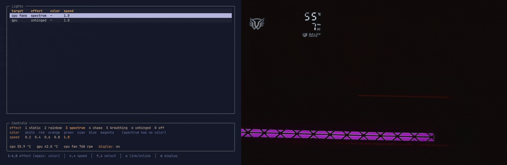

# Mimarchy

**Omarchy-native LED control for CPU cooler fans and GPU.**

A single-screen TUI for the ARGB lighting on a CPU cooler's fans and a graphics
card, plus the cooler's built-in temperature display. It is built for
[Omarchy](https://omarchy.org/) specifically: it takes every colour from your
active Omarchy theme at startup, and it launches from a Waybar icon into a
floating window in the same style as `bluetui` and `nmtui`. Lighting reaches the
motherboard headers and the card over the OpenRGB SDK; the cooler's display is
driven directly over HID with a protocol reverse-engineered for it.



## What it does

- **Effects** — static, rainbow, spectrum, chase, breathing, and *unhinged*,
  all rendered in software from one clock so both devices stay in phase.
- **Linked or independent** — CPU and GPU move together by default; unlink to
  drive them separately.
- **Theme-driven** — no colour is hardcoded. Switch Omarchy themes and the TUI
  follows on next open.
- **Sensors** — CPU and GPU temperature, fan RPM.
- **Cooler display** — streams live temperature and fan speed to the panel.

## Hardware

Developed against an ASUS PRIME X870-P WIFI, a Sapphire RX 9070 XT Nitro+, and
a Balam Rush Heliux Pro HEX75 cooler. Anything OpenRGB can drive should work for
the lighting; `[rgb.zones]` in the config is how you point it at your own
devices. The cooler display is specific to that USB device (`5131:2007`).

## Install

```bash
git clone https://github.com/villenull/mimarchy
cd mimarchy
./install.sh
```

That creates a virtualenv, narrows OpenRGB's detector list, installs and starts
the user services, and prints the two or three steps that need root or a config
merge. Then:

```bash
mimarchy-tui
```

Requires Python 3.11+, `openrgb`, and a running Wayland session. Fan RPM
additionally needs the out-of-tree `nct6687d` driver — temperatures and lighting
work without it.

> **One ordering constraint the script handles for you:** OpenRGB's broad
> GPU/I2C detection is a documented total-system freeze on some cards
> ([#4888](https://gitlab.com/CalcProgrammer1/OpenRGB/-/issues/4888)), and its
> service starts at login. `install.sh` narrows the detector list *before*
> starting the server for the first time. If you set this up by hand, do it in
> that order — and re-run `tools/restrict-openrgb-detectors.py` after ever
> opening the OpenRGB GUI, which rewrites the config.

## Keys

| Key | Action |
|---|---|
| `1`–`6` | static / rainbow / spectrum / chase / breathing / unhinged |
| `0` | off |
| same number again | next colour, for effects that take one |
| `←` `→` | speed down / up (`-` and `+` also work) |
| `↑` `↓` | move the selection |
| `u` | link / unlink CPU and GPU |
| `d` | cooler display on / off |

There is deliberately no quit key — this is an overlay, closed by closing its
window, like `bluetui`. `Ctrl+C` still works.

## Notes

Lighting only animates while `mimarchy-light.service` runs; stopping it freezes
the LEDs on their last frame. The cooler display has no off command in its
protocol — `d` stops the telemetry stream, and the panel blanks itself about 50
seconds later.

[docs/hardware-notes.md](docs/hardware-notes.md) covers the parts that were not
obvious: why zone sizing is mandatory, why effects are rendered rather than run
on the controllers, how the display protocol was worked out, and every
measurement behind those decisions.

## License

[MIT](LICENSE).
